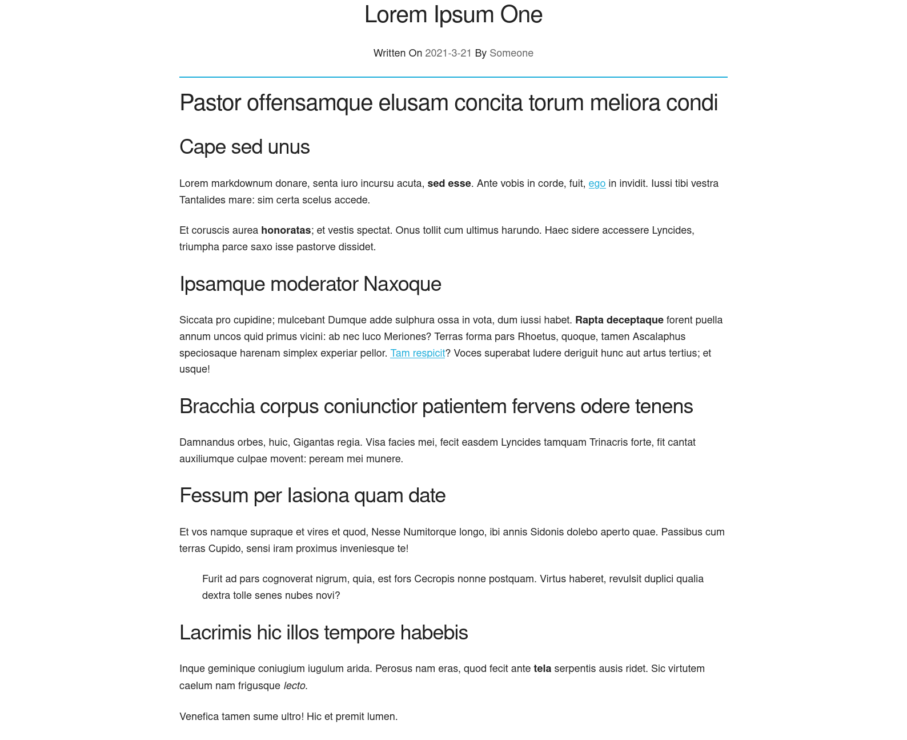

# STOG
STOG is a static blog generator from a directory of markdown files.

**WARNING: I'm new to [rust](https://rust-lang.org) and this is my second project with [rust](https://rust-lang.org), so this project may have lots of bugs, and it will be unstable, but it will get better and better over time.**

## Installation:
For installation you will have two options:

1. install from source code
2. install from cargo

### From cargo:
```bash
cargo install stog
```

### From the source code:
1. Clone the repository:

```bash
git clone https://github.com/zolagonano/stog.git
```

2. Change your working directory to source code directory:

```bash
cd stog
```

3. Compile and run:

```bash
cargo build --release
cargo run
```

## Usage:
### Create new blog:

```bash
stog init <blog_name>
```

### Customize your blog:
- Edit `config.toml` to change basic settings.
- Edit template files witch located at `_templates`.
- Add your CSS/javascript files to the `public` directory and it will copy them to the build directory(**Notice that you should change your templates to use your CSS and javascript.**).

### Build your blog:
Run stog with build subcommand to build your directory(**the result will be located at `_build`**):

```bash
stog build
```

Now you can take `_build` directory and host it anywhere.

## Screenshots:


## Contribute:
All contributions are welcome but if you don't know what you can do look at this list:

- Open an issue if you find a bug.
- Open an issue if you have a suggestion.
- Fix bugs and send pull requests.
- Share it with your friends.
- And anything else you think will help this project :).
